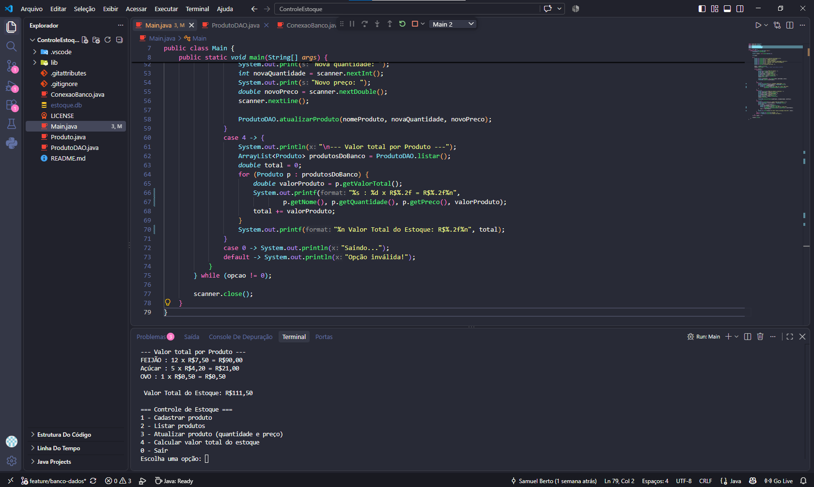

# Controle de Estoque

Aplicativo de controle de estoque em Java, desenvolvido como projeto de estudo.

## 📋 Sobre o projeto

Sistema de linha de comando (CLI) para gerenciar produtos em estoque, permitindo cadastro, listagem, atualização de quantidade e cálculo de valor total.

## ✅ Funcionalidades

- [x] Menu interativo no terminal
- [x] Classe `Produto` (nome, quantidade, preço)
- [x] Persistência de dados com banco SQLite
- [x] Cadastro de produtos (via SQL - INSERT)
- [x] Listagem de produtos (via SQL - SELECT)
- [x] Atualização de quantidade e preço (via SQL - UPDATE)
- [x] Cálculo de valor total do estoque, formatado em decimal
- [ ] Exclusão de produtos
- [ ] Busca de produto por nome

## 📸 Demonstração

## 🛠️ Tecnologias

- **Java** (JDK 21+)
- **SQLite** (via JDBC) — persistência de dados
- **Git/GitHub** — controle de versão, com fluxo de branches (`feature/*`) e Pull Requests

## 📁 Estrutura do projeto

ControleEstoque/
├── Main.java              # Menu principal
├── Produto.java           # Classe modelo do produto
├── ConexaoBanco.java      # Conexão e criação da tabela no SQLite
├── lib/
│   └── sqlite-jdbc-*.jar  # Driver JDBC do SQLite
├── .vscode/
│   └── settings.json      # Configuração de bibliotecas do VS Code
└── README.md

## 🚀 Como rodar

1. Clone o repositório
2. Abra no VS Code com a extensão "Extension Pack for Java" instalada
3. Rode a classe `Main.java`

## 📚 Aprendizados até aqui

Este projeto está sendo usado como estudo prático de:
- Programação orientada a objetos em Java (classes, atributos, getters/setters, encapsulamento)
- Estruturas de controle (`do-while`, `switch`)
- Coleções (`ArrayList`)
- SQL (`CREATE TABLE`, `INSERT`, `SELECT`, `UPDATE`, `DELETE`)
- Conexão Java + banco de dados via JDBC
- Fluxo de trabalho com Git: branches por funcionalidade, commits, Pull Requests e merge

## 📝 Licença

Este projeto está sob a licença MIT.

## 👤 Autor

**Samuel Berto**
- GitHub: [@SamuellBerto](https://github.com/SamuellBerto)